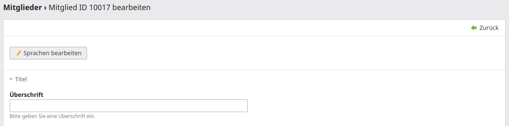
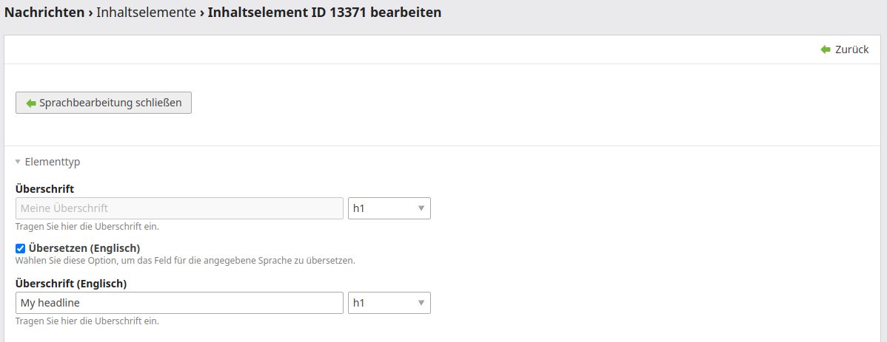

# Contao Multilingual Fields Bundle

This utility bundle offers functionality to translate arbitrary fields of any table-driven data container in the Contao CMS.

## Features

- define which fields of which data containers should be translatable

## Impressions





## Use case

The use case for this bundle is to have an automatic and structured process for adding translatable fields to a data container.

## How does it work?

The bundle works quite simply: it looks into your project's `<project_dir>/config/config.yml` and based on that adds
the fields defined here as translatable fields.

Example: Imagine the following `config.yml` (position is the field representing the job of the member in the company):

```yaml
huh_multilingual_fields:
   fallback_language: de
     languages:
       - en
   data_containers:
      palettes:
         - default
      tl_member:
         fields:
            - { name: position, legend: personal }
```

This would end up in your DCA being automatically modified the following way:

```php
// ...
[
    // the original position field is unchanged
    'position' => [
       'exclude'                 => true,
       'search'                  => true,
       'inputType'               => 'text',
       'eval'                    => ['maxlength' => 128, 'tl_class' => 'w50', 'mandatory' => true],
       'sql'                     => "varchar(128) NOT NULL default ''"
   ],
    // this field is created automatically
   'en_position' => [
       'label'                   => ['Position (English)', '<the description as given>'], // generated automatically out of the label of the "position" field
       'exclude'                 => true,
       'search'                  => true,
       'inputType'               => 'text',
       'eval'                    => ['maxlength' => 128, 'tl_class' => 'w50', 'mandatory' => true],
       'sql'                     => "varchar(128) NOT NULL default ''"
   ]
]
```

## Installation & configuration

1. Run `composer require heimrichhannot/contao-multilingual-fields-bundle`.
1. Create the file `<project_dir>/config/config.yml` if not already existing and specify your translatable fields:
   ```yaml
   huh_multilingual_fields:
     fallback_language: de
     languages:
       - en
     data_containers:
       palettes:
         - default
       tl_member:
         fields:
           - { name: position, legend: personal }
   ```
1. Clear the project's cache (`<project_dir>/var/cache`).
1. Update the database. The new fields should be created now.
